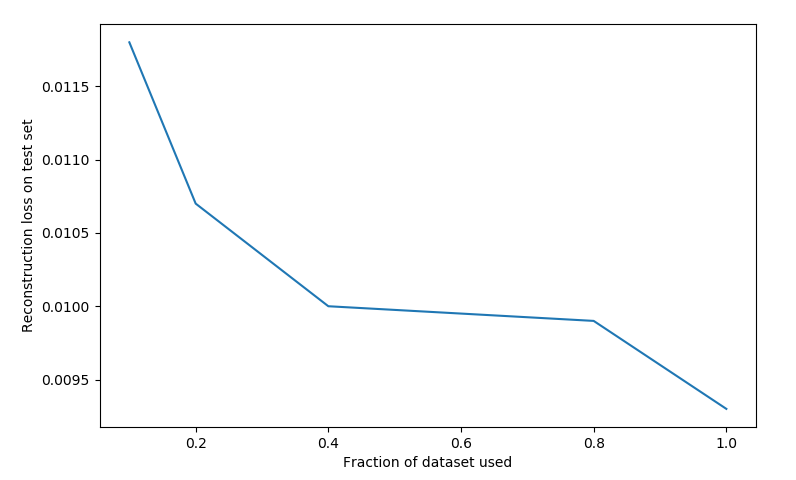
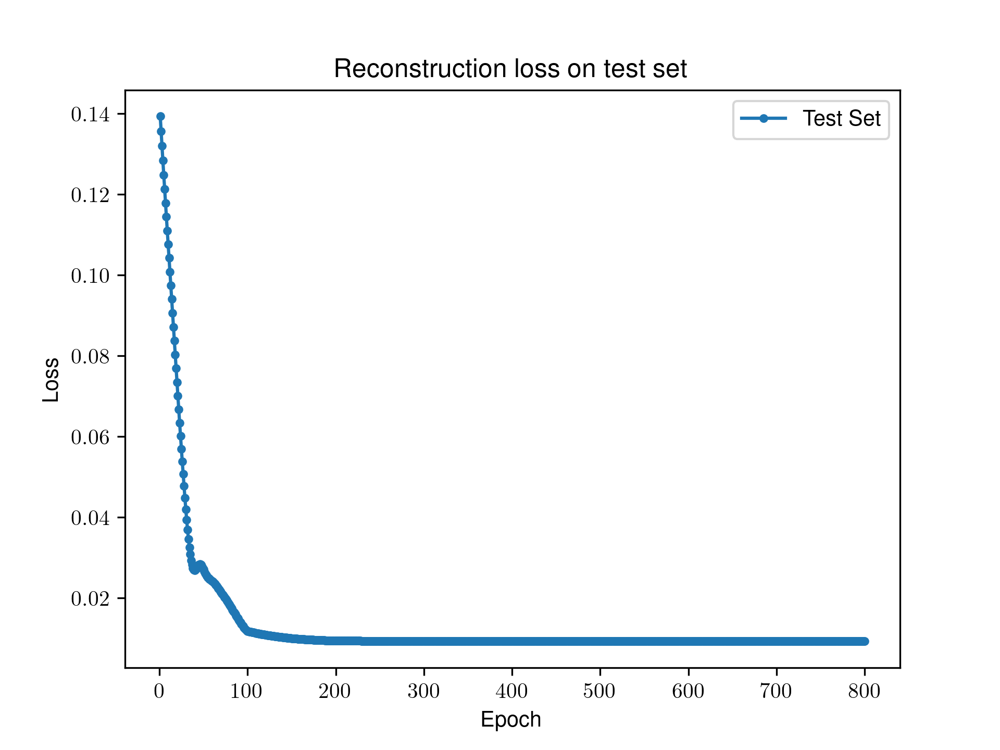
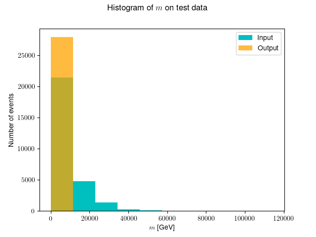
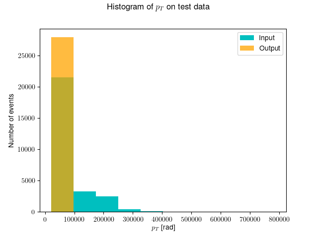
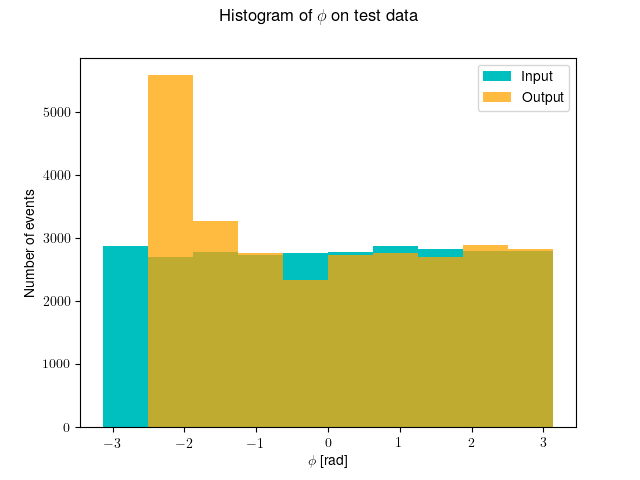
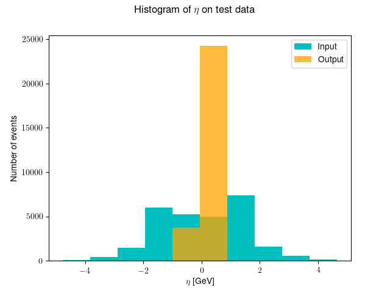
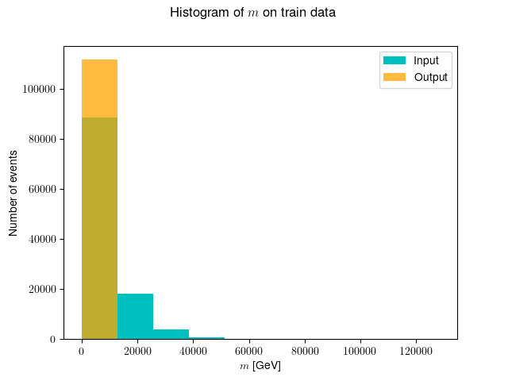
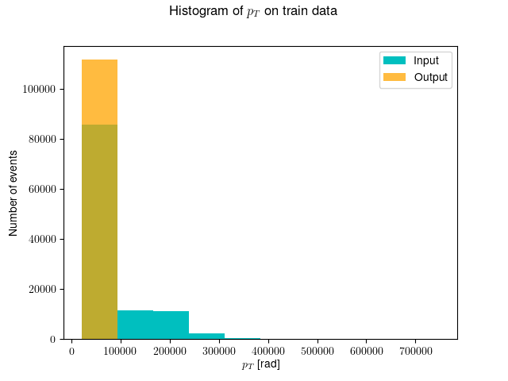
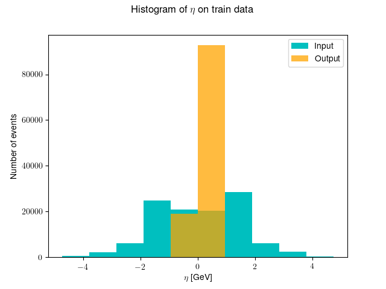

# HEPAutoencoders

Compressing ATLAS trigger jet events data using autoencoders. The data is available [here](https://drive.google.com/drive/folders/1JaCB-prsDhEX4Ovk-UjC9bMxOHbpfREr). The data consists of 4D Lorentz vectors which are to be compressed down to 3D.

### Requirements
* PyTorch >= 0.4.0

### Optional
* TensorFlow 2.1.0 and TensorBoard 2.1.1 for live visualization of the training process

### Approach
The approach is to scale the data between \[0,1\] instead of normalizing with 0 mean and unit variance. Having the data in range \[0,1\] gives more choice of activation functions. In the network only fully connected layers are used. The architecture is `4-512-256-128-3-128-256-512-4`. The activation function of choice is LeakyReLU. The network is trained to reconstruct the 4 original values using MSELoss.

### How to Use ?
1. Download the [data](https://drive.google.com/drive/folders/1JaCB-prsDhEX4Ovk-UjC9bMxOHbpfREr) and put the `.pkl` files in the same directory as this repository
2. Run `train.py`. This will start the training of the AutoEncoder. Note that any changes in hyperparameters need to be changed via modifications in `train.py` itself (at least for now)
3. While the training code is running, you can visualize the losses on TensorBoard
4. After the training is complete, there will be a TensorFlow summary file and checkpoints in the `./runs/XXXXX/` directory(`XXXXX` is the timestamp for start of the training)
5. Now you need to download data from TensorBoard in the form of CSV for tag `test_loss`. Then give path to your CSV file and relevant checkpoint (`.pt`) files in `generate_plots.py` to generate required plots.

### Observations

The [original](https://github.com/Skelpdar/HEPAutoencoders/blob/master/4D/fastai_AE_3D_200_no1cycle.ipynb) experiment for similar concept consisted of training an autoencoder on fraction of data. (The [notebook](https://github.com/Skelpdar/HEPAutoencoders/blob/master/4D/fastai_AE_3D_200_no1cycle.ipynb) only loads 20% data). Therefore, I first checked if using less data would suffice. However, the following plot shows that training on more data is actually better. Ultimately I resorted to training on full (100%) data.

    

The reconstruction loss on test set varies as follows:

    

The above plot plateaus after about 300 epochs. This means that training for 300 epochs is sufficient to get the claimed results. I also checked how much related the uncompressed and original distribution are. Following histograms show similarity between uncompressed data (from autoencoder) and the original results.

|   |   |
| :-------------------------: | --------------------------- |
|   |   |
|  |  |
|  |  |

### Discussion
The results I obtained are not as good as the [original](https://github.com/Skelpdar/HEPAutoencoders/blob/master/4D/fastai_AE_3D_200_no1cycle.ipynb) experiments. However, I wanted to demonstrate that I have understood the basic flow and pipeline of data processing for this project. I have also plotted the necessary things to compare the reconstructed data distribution to original data distribution. 

In this specific experiment, I wanted to implement a novel model and standardize the training and evaluation pipeline. My current code is extremely flexible, it allows change in model and hyperparameters very easily. This will enable fast prototyping and will allow me to finish the actual project quickly. My novel model also takes in the number of internal connections as a hyperparameter, this means that we won't need differenct classes for `AE_3D_200` and `AE_3D_100`. They are unified into single model where you pass the number of connections as the input. Moreover, my current code uses better terminology as compared to the [original](https://github.com/Skelpdar/HEPAutoencoders/blob/master/4D/fastai_AE_3D_200_no1cycle.ipynb) code (There the author uses somewhat vague names for autoencoders such as `AE_big`).

My current pipeline allows live monitoring of the model training (via TensorBoard) which could be massively useful. This means that the mentors can access my TensorBoard as I am training the model and give me relevant instruction without waiting for the entire training to complete. Overall, my current pipeline will enable speedy prototyping and allow me to finish project in a systematic way while also saving time.
